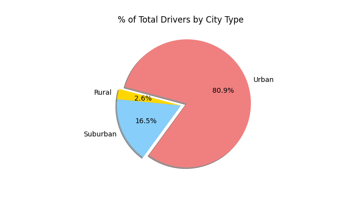

# PyBer with Matplotlib (Module 5)

[Link to Jupyter Notebook code](PyBer_Challenge.ipynb)

## Overview of PyBer Ride Sharing Data Analysis

### Purpose
Completed an analysis of PyBer ride sharing data across a cross-section of markets comprised of urban, suburban, and rural communities.

Provided the following assessments:

1. For each PyBer city type, calculated the following:
	* Total number of rides
	* Total number of drivers
	* Total fares
	* Average fare per ride
	* Average fare per driver

2. Prepared a multiple-line graph depicting total fares for each week between January 1 and April 28, 2019 by city type

### Resources

This project was prepared using the following:
* Python 3.7.6
* Matplotlib 3.4.3
* Anaconda 4.12.0
* Jupyter Notebook 6.4.5
* Matplotlib 3.4.3

Source data provided by PyBer: 

[Link to city data](Resources/city_data.csv)

[Link to ride data](Resources/ride_data.csv)

## PyBer Analysis Results

### Summary Conclusions:
The analysis yielded the following conclusions:

* Total Rides: Urban communities accounted for approximately 68% of total rides generated.

* Total Drivers: Urban communities accounted for approximately 81% of total drivers.

* Total Fares: Urban communities accounted for approximately 63% of total fares.

* Average Fare per Ride: Rural communities generated the highest average fare per ride.

* Average Fare Per Driver: Rural communities also generated the highest average fare per driver.

* Total Fare by City Type: An assessment of total weekly fares by city type between January 1 and April 28, 2019 indicates that suburban trips peaked during the week of February 24, urban trips the week of March 10, and rural trips the week of April 7. 

## PyBer Analysis Summary

### Recommendations
The following recommendations are provided to address disparities among the city types:

1. Pyber could consider a campaign to recruit additional drivers in rural communities as the average fare per ride and per driver are higher.
2. As the peak level fare generation occurred during a different week for each community type, Pyber could consider shifting some drivers within its system to better match ride demand with driver availability.
3. Pyber could continue the weekly fare trend analysis to determine if the strong growth in suburban fare generation continued into the summer months; if so, a promotional campaign may be warranted. 
